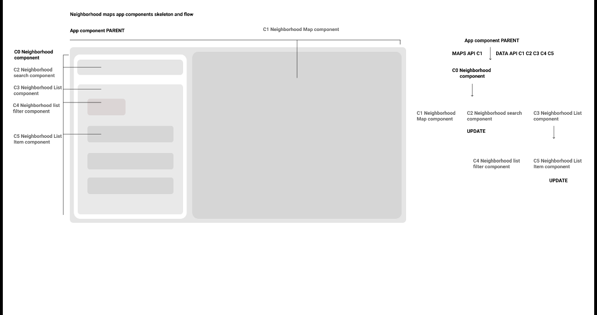

# FEND: Final Project - Neighborhood Map

#### About the project
The app displays a map of the most popular/trending parks/recreational places in the bay area: water, theme parks, trailings, camping, summer camps, lake parks, beaches, forest parks.

The user can filter/search the parks by: location, popularity, co$t of admission. The app is built with [React 16](). The app utilizes the [Foursquare Places API]() and the [Google Maps API]().

## How to Install

#### Install project

- Download repo or clone

#### How to install Depencencies

- Install dependencies `npm install`

#### How to start Developmet

- Start Developing `npm start`

**Source code file structure**
```bash
 src/
├── App.css
├── App.jsx
├── App.test.js
├── components
├── FoursquareAPI.js
├── GoogleFontsAPI.js
├── GoogleMapsAPI.js
├── icons
│   ├── filter.svg
│   ├── search.svg
│   └── star.svg
├── index.css
├── index.js
└── registerServiceWorker.js
```

### TODO
- ~~Create app components structure/flow~~



- How Google Maps work in react???
- How to handle componets states data from third party apis?
- Control states and lifecycles???
- Usabillity/a11y
- How to handle api services when not available? that is loading services and handling network issues. Enable
service workers

#### How to build Production

- Build project `npm run build`
- Open build `serve -s build` to open browser at `http://localhost:8000`
- **Pro tip #1** Run `npm run build && serve -s build` then open browser at `http://localhost:8000`
- **Pro tip #2**  Open `package.json` and edit the `build script` ex: ` "build": "react-scripts build && serve -s build"` then run single command `npm run build` then open browser at `http://localhost:8000`

#### About APIs

- [Foursquare API](https://developer.foursquare.com)
  - [Foursquare Docs](https://developer.foursquare.com/docs)
- [Google Maps]()
  - [Maps Docs]()

## Shoutouts

- [Foursquare API]()
- [React]()
- [PureCSS Loaders](https://loading.io/css/)

## One last thing

Thanks to the [Udacity team/instructors/mentors/mates++]() for all the support, knowledge and guidance provided during the cource of the program and for giving me the scholarship, i'm very thankfull for that, promise not to let you down, thank you to the Infinity

## Feedback

Is welcome, get in touch @ [giovannilara.com](http://giovannilara.com) or DMe on GitHub

## Licence

[MIT](Licence)